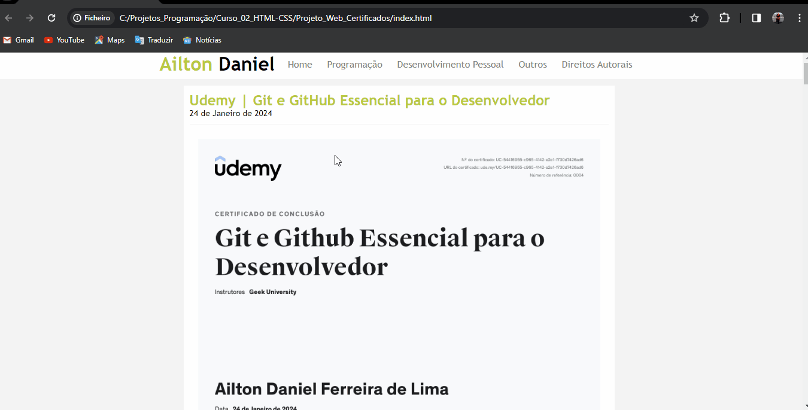

# Ailton Daniel - Certificados

Este projeto tem como objetivo criar um site/blog simples para divulgar certificados adquiridos, utilizando HTML e CSS. 

## Recursos Principais

- Visualização da lista dos certificados
- Navegação entre as categorias através da barra de navegação superior
- Interface simplificada e amigável para facilitar a navegação e utilização do site.

## Tecnologias Utilizadas

Este projeto utiliza as seguintes tecnologias:

HTML: Utilizado para a estruturação do conteúdo do site.
CSS: Utilizado para estilização e design da interface do usuário.

## Instalação

1. Clone este repositório: `https://github.com/https-ailton-dev/ProjetoWeb-Certificados.git` ou `git@github.com:https-ailton-dev/ProjetoWeb-Certificados.git`
2. Navegue até o diretório do projeto.

## Como Usar

1. Execute o código no navegador de sua escolha.
2. Navegue pelas diferentes páginas dedicadas de cada modelo.
3. Explore cada funcionalidade oferecida.

# Desmontração
1. Index

2. Navegação entre páginas

